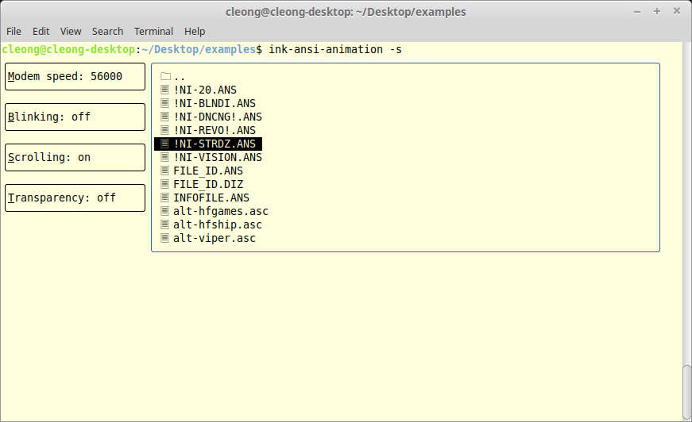

# ink-ansi-animation

Ink-based console program for playing ANSI animations. It makes use of the 
[react-ansi-animation](https://www.npmjs.com/package/react-ansi-animation) library.

## Installation

```sh
npm install -g ink-ansi-animation
```

## Usage

```sh
$: ink-ansi-anmation
```

ink-ansi-anmation will look for ANSI files in the current working directory and display them in a list. 
Press `ENTER` to play a file. Press `ENTER`, `ESC`, or `SPACE` to return to the list. Press `M`, `B`, 
`S` or `T` to change the different settings.

## Screenshots




